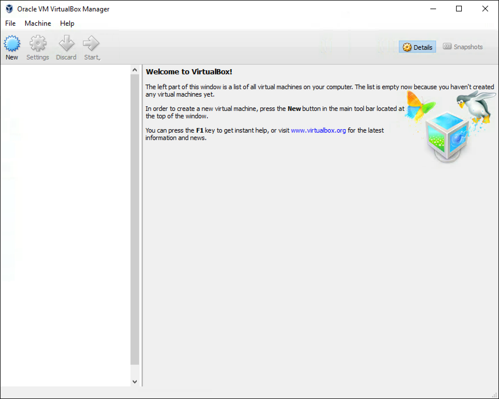

# Virtualization

### Cybersecurity First Principles
* __Domain Separation__: Good fences make good neighbors. When trying to secure a home or computer, separating the areas where resources are and people work prevents accidents and loss of data or private information. We are preventing the information worlds from colliding.

### Table of Contents
[Introduction](#introduction)  
[Installing VirtualBox](#installing-virtualbox)  
[Installing Ubuntu Linux Guest OS](#installing-ubuntu-linux-guest-os)  
[Installing Software in Guest OS](#[installing-software-in-guest-os)  
[Additional Tasks](#additional-tasks)  
[Further Readings](#further-readings)  


### Introduction

Virtualization is a technique to abstract computer hardware resources like CPU, memory and input/output devices and share them among multiple __guest__ Operating Systems (OS). The guest OSes are managed by a __host__ OS. Each guest OS is completely unaware of other guest OSes and the shared nature of the underlying physical resources. Virtualization provides domain isolation between different guest OSes as well as between a guest and host OS. The guest OS is also referred to as a __virtual machine__ or VM for short.

Today virtualization technologies are the essential to the operation of large scale data centers. Virtualization allows multiple tenants to share the same data center resources without encroaching on each other's data and programs.

In this module we will, install virtualization software on a Windows host OS. Next, install a Ubuntu Linux guest OS. This setup will provide domain separation between our host OS and a sacrificial development environment. Any changes and/or "accidents" in the guest OS, stay contained within the virtual image. Thus, virtualization also allows safe experimentation with unknown software programs and malware samples.

Our entire setup is based on Free and Open Source Software (FOSS). When using FOSS, always remember that it has copyright and license restrictions which must be respected.

[Top](#table-of-contents)

### Installing VirtualBox

Virtual Box is a free open source virtualization software from Oracle. For a Windows host OS, Virtual Box installation executable can be downloaded from here:

```text
https://www.virtualbox.org/wiki/Downloads
```
Click on the `VirtualBox xx.xx.xxx for Windows hosts  x86/amd64` download link. Once the file is downloaded, proceed with installation by double clicking it. Continue with presented defaults and answer yes to any prompts. Installation will require an account with administrative privileges.

Upon successful installation, you should see this.



To create a new VM, press the blue "New" button.

Now we need a installation CD for the guest OS of our choice.

[Top](#table-of-contents)

### Installing Ubuntu Linux Guest OS


[Top](#table-of-contents)

#### Security tip
Do not to allow shared folders and storage volumes between virtual images. This prevents unintended data sharing between separated domains.

[Top](#table-of-contents)

### Installing Software in Guest OS


[Top](#table-of-contents)

### Additional Tasks

Install guest additions. 

[Top](#table-of-contents)

### Further Readings

* Virtual Box [User Manual](https://www.virtualbox.org/manual/UserManual.html)


[Top](#table-of-contents)

#### License
<a rel="license" href="http://creativecommons.org/licenses/by-nc-sa/4.0/"></a><br /><span xmlns:dct="http://purl.org/dc/terms/" property="dct:title">Cybersecurity Modules</span> by <a xmlns:cc="http://creativecommons.org/ns#" href="http://faculty.ist.unomaha.edu/rgandhi/" property="cc:attributionName" rel="cc:attributionURL">Robin Gandhi</a> is licensed under a <a rel="license" href="http://creativecommons.org/licenses/by-nc-sa/4.0/">Creative Commons Attribution-NonCommercial-ShareAlike 4.0 International License</a>.
