# Virtualization

### Cybersecurity First Principles
* __Domain Separation__: Good fences make good neighbors. When trying to secure a home or computer, separating the areas where resources are and people work prevents accidents and loss of data or private information. We are preventing the information worlds from colliding.

### Table of Contents
[Introduction](#introduction)  
[Installing VirtualBox](#installing-virtualbox)  
[Installing Ubuntu Desktop Linux VM](#installing-ubuntu-desktop-linux-vm)  
[Customizing the VM](#customizing-the-VM)  
[Installing Software in the VM](#installing-software-in-the-vm)   
[Installing Ubuntu Server Linux VM](#installing-ubuntu-server-linux-vm)   
[Launch an existing VM](#launch-an-existing-VM)  
[Additional Tasks](#additional-tasks)  
[Further Readings](#further-readings)  


### Introduction

Virtualization is a technique to abstract computer hardware resources like CPU, memory and input/output devices and share them among multiple __guest__ Operating Systems (OS). The guest OSes are managed by a __host__ OS. Each guest OS is completely unaware of other guest OSes and the shared nature of the underlying physical resources. Virtualization provides domain isolation between different guest OSes as well as between a guest and host OS. The guest OS is also referred to as a __virtual machine__ or VM for short.

Today virtualization technologies are the essential to the operation of large scale data centers. Virtualization allows multiple tenants to share the same data center resources without encroaching on each other's data and programs.

In this module we will, install virtualization software on a Windows host OS. Next, install a Ubuntu Linux guest OS. This setup will provide domain separation between our host OS and a sacrificial development environment. Any changes and/or "accidents" in the guest OS, stay contained within the virtual image. Thus, virtualization also allows safe experimentation with unknown software programs and malware samples.

Our entire setup is based on Free and Open Source Software (FOSS). When using FOSS, always remember that it has copyright and license restrictions which must be respected.

[Top](#table-of-contents)

### Installing VirtualBox

Virtual Box is a free open source virtualization software from Oracle. For a Windows host OS, Virtual Box installation executable can be downloaded from here:

```text
https://www.virtualbox.org/wiki/Downloads
```
Click on the `VirtualBox xx.xx.xxx for Windows hosts  x86/amd64` download link. Once the file is downloaded, proceed with installation by double clicking it. Continue with presented defaults and answer yes to any prompts. Installation will require an account with administrative privileges.

Upon successful installation, you should see this.

>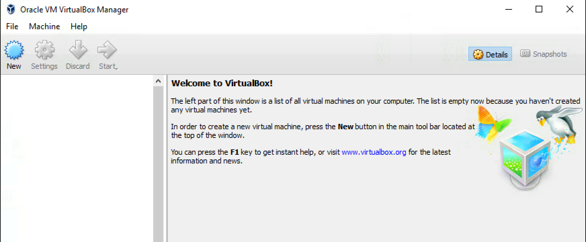

[Top](#table-of-contents)

### Installing Ubuntu Desktop Linux VM

We will use Ubuntu Linux guest OS to setup a user-friendly developer environment. It is a popular linux distribution and most OSS packages have installation procedures for it. In particular, 64-bit OS version 14.04 Trusty Thar is well supported in that regards. Facebook CTF OSS packages also support it. `https://github.com/facebook/fbctf`

To create a new VM, press the blue `New` button in VirtualBox. It should bring up a Create VM prompt.

>

Go ahead and enter a `Name:` like `Dev Machine`  
When you list the `Type:` option, you will see that VirtualBox support many types of guest OSes. Select `Linux`.  
For `Version:` select `Ubuntu (64-bit)`  
Your final configuration should look like this. Then click Next.

>

Now adjust the amount of RAM available to the VM. 2GB (2048 MB) is good, but if your physical machine does not have a lot of RAM then leave it at 768 MB. My machine has 8 GB RAM, so I had plenty of room to spare. Click Next.

>

The next step creates a virtual hard drive for the VM. Select the `Create a virtual hard disk now` option. Then click Create.

>

On the next `Hard disk file type`prompt, change the selection to **VMDK**. This hard drive format plays nice with VMware, another popular virtualization software. It is also compatible with the Open Virtualization Format (OVF) to export VMs between different virtualization environments. Click Next.

>

To optimize storage, select the `Dynamically allocated` option on the `Storage on physical hard disk` prompt. Click Next.

>

Finally, in the `File location and size` prompt specify the name of the new hard drive and select a location to save it in. On your physical machine, the hard drive appears as a single, large VMDK file. Click Create.

> 

The Dev Machine VM is now ready to be started in VirtualBox. It is currently powered off.

> 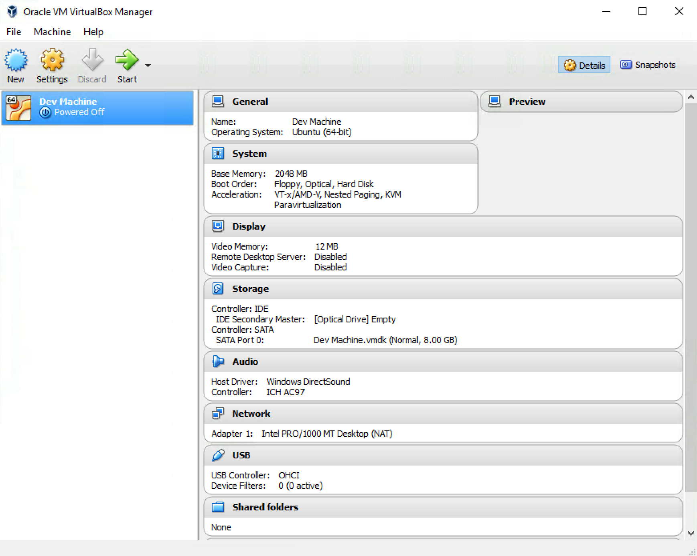

Now before you hit the "green" Start button, we need a installation CD for the Ubuntu VM. Download the ISO file for Ubuntu 14.04 64-bit Desktop version from here. It is a larger download but it includes all the files needed for installation.

```text
http://releases.ubuntu.com/trusty/ubuntu-14.04.4-desktop-amd64.iso

```
Save the ISO file in a convenient location on your computer.  
> Optional: Check C:/ISO/Desktop folder to see if this file is already on your computer

Now hit the Start button for the **Dev Machine** VM in VirtualBox. A `Select start-up disk` prompt should appear. Click the Folder Icon with a green pointer.

> 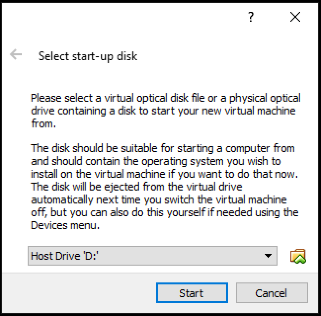

Browse to the location where you saved the Ubuntu ISO file. Then select the ISO file as the start-up disk. The VM now start with a boot screen displayed.

> 

As you interact with the VM window, you will notice that it captures your mouse pointer. To release the mouse pointer you have to press the **host key** on your keyboard. Upon clicking in the VM window, VirtualBox shows an information dialog box describing how the host key works. In this case, the host key is the **Right Alt** key. Once you are aware of the host key, select the `Do not show this message again` and click `Capture`. To return to your host OS, press the host key to release your mouse from the VM window.

> 

Now click anywhere in the VM window for it to capture the mouse once again. Then click on the `Install Ubuntu` button.

> 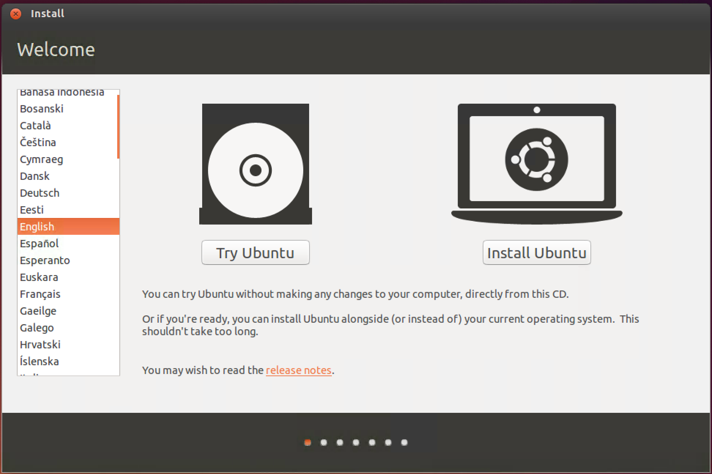

Click `Continue` on the next prompt.

> 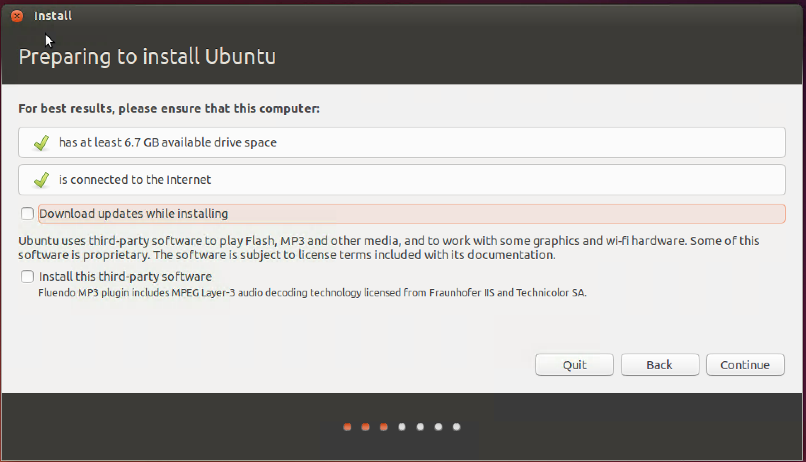

The next prompt warns you about `Erase disk and install Ubuntu`. We are OK with this since this action will be carried out on the new virtual hard drive that we created for just this purpose. It does not impact your host OS hard drive.

> 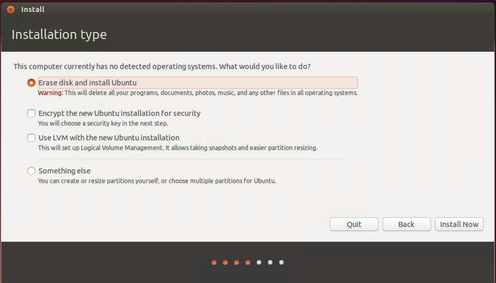

Click `Continue` on the next few prompts.

> 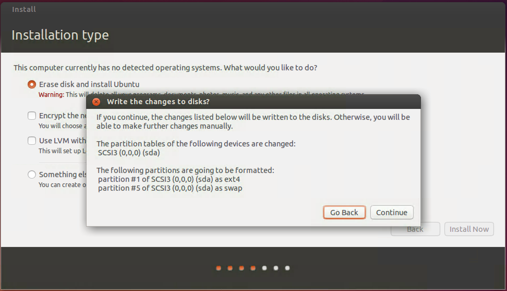

> 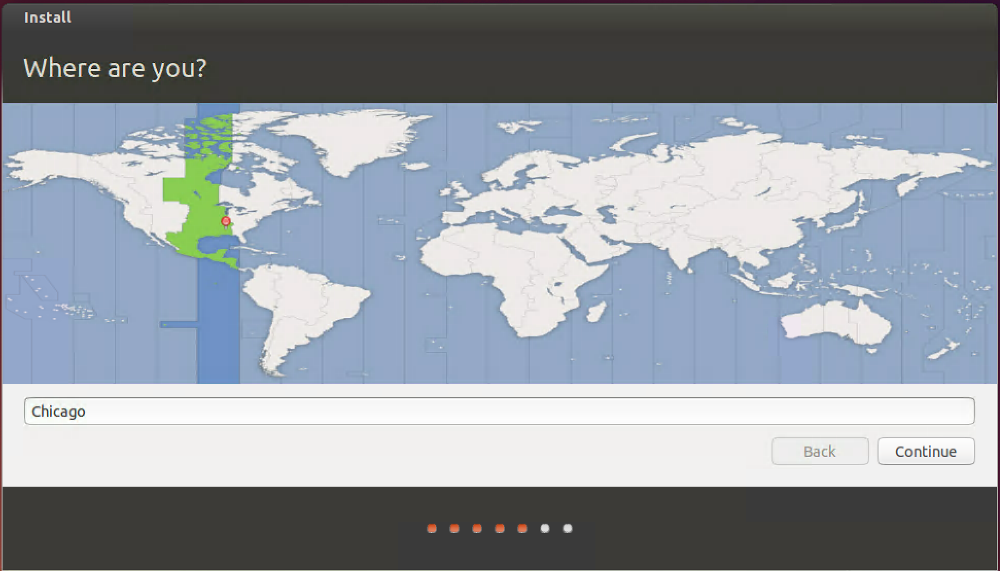

On the `Who are you?` prompt, enter account details. Since this is a sacrificial Dev Machine. Setup a generic account name. Remember these details to login to the machine later.
> 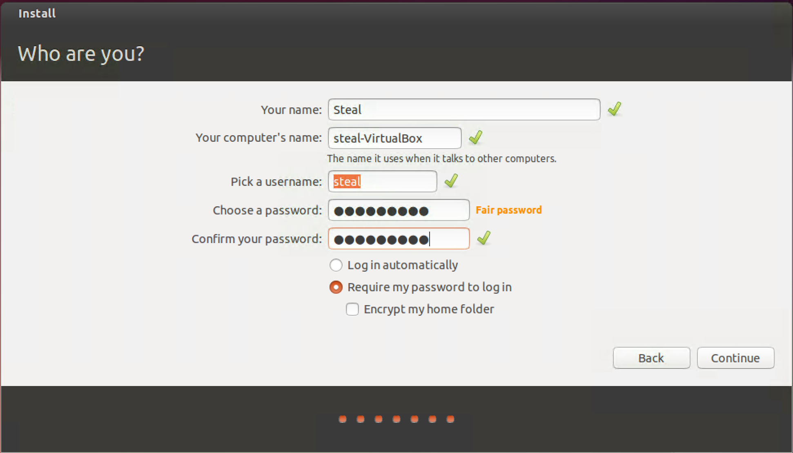

After a few more prompts, the installation should be completed.
> 

Restart the machine
> 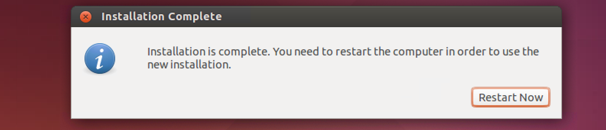

Hit `ENTER` to complete restarting and finish installation.
> 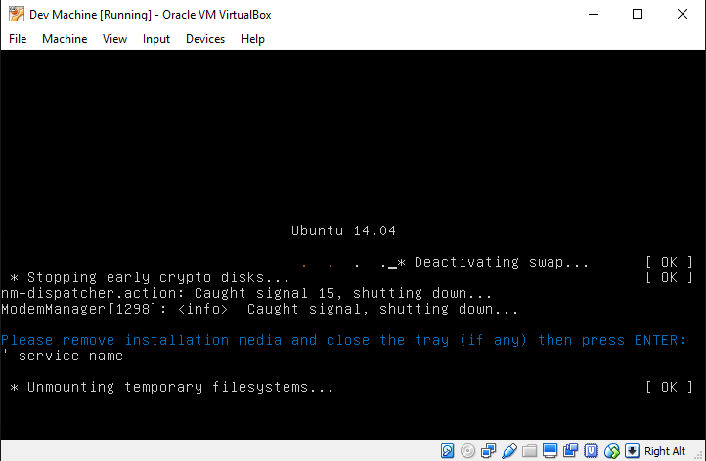


### Customizing the VM

Upon restarting after installation, you should see a login prompt. Login with your account credentials setup during installation.
> 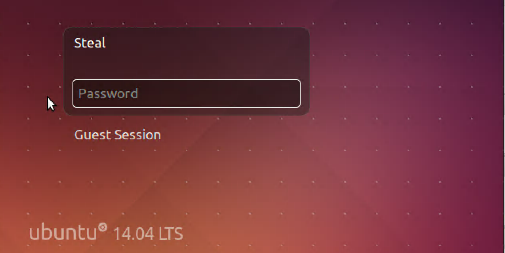

For development you will be working a lot in the `Terminal` app. To start it click the Ubuntu home icon and type "Terminal". Select the Terminal app from the search results.
> 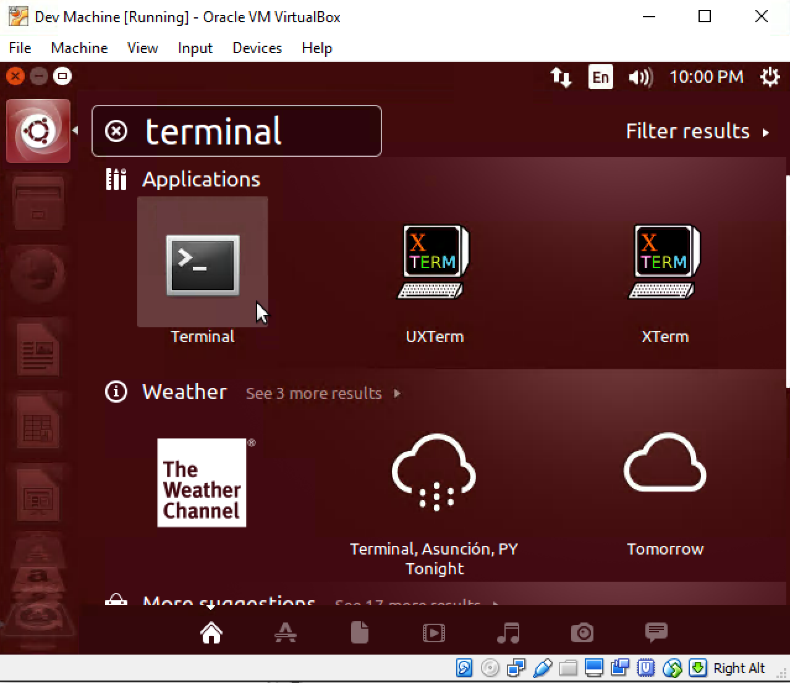

A terminal app will appear. In the terminal type the `ls` command to list the directories in your home folder.
> 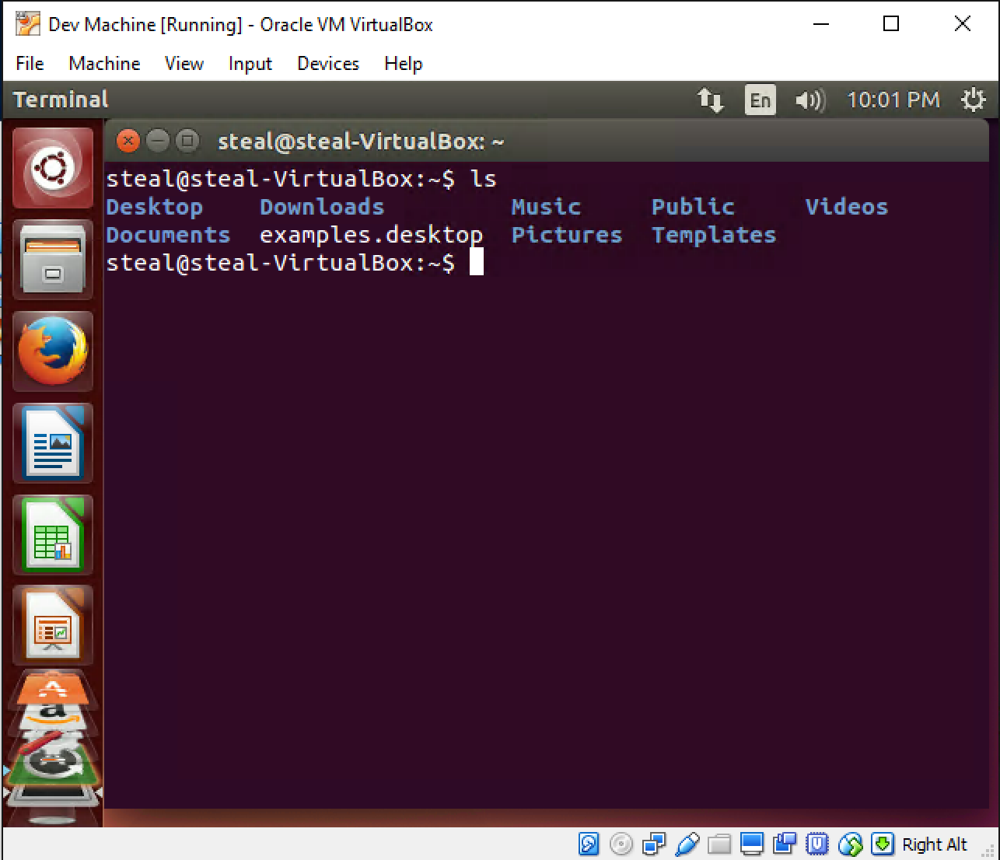

You will probably notice that the screen resolution for the VM window is not very user-friendly. However, just resizing the window does not change the screen resolution of the VM Desktop. To enable these features we need to install Guest Additions in the guest OS. Select the `Insert Guest Additions CD image...` menu option as shown below.
> 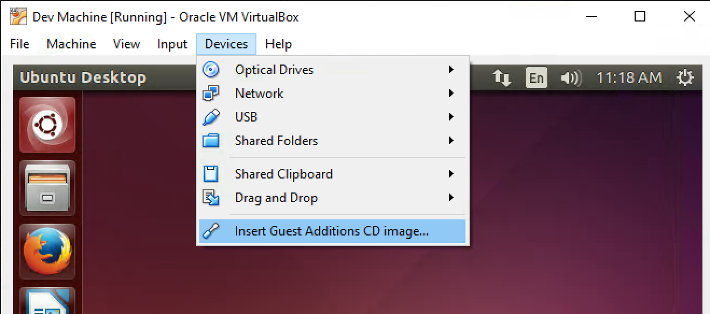

Click run on the next prompt.
> 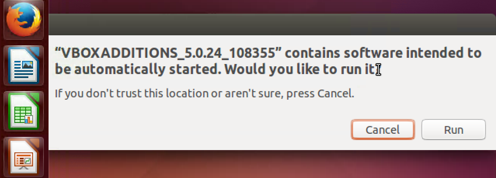

To proceed with the installation, enter your account password.
> 

After a successful install you should see a terminal window like this.
>

Restart the machine by clicking on the power button in the upper right-hand corner. Then select the Restart option.
> 

Upon restarting you should be able to resize the Desktop to comfortable resolution by just resizing the VM window. You may also enter Full Screen Mode, by pressing `Alt + F`. You can exit full screen mode by pressing `Alt + F` again.

Now start the terminal app as shown before and pin it to the Dock. You can accomplish this by right clicking the dock icon and selecting `Lock to Launcher` option. This shortcut will come in handy for invoking terminals for development related tasks.
> 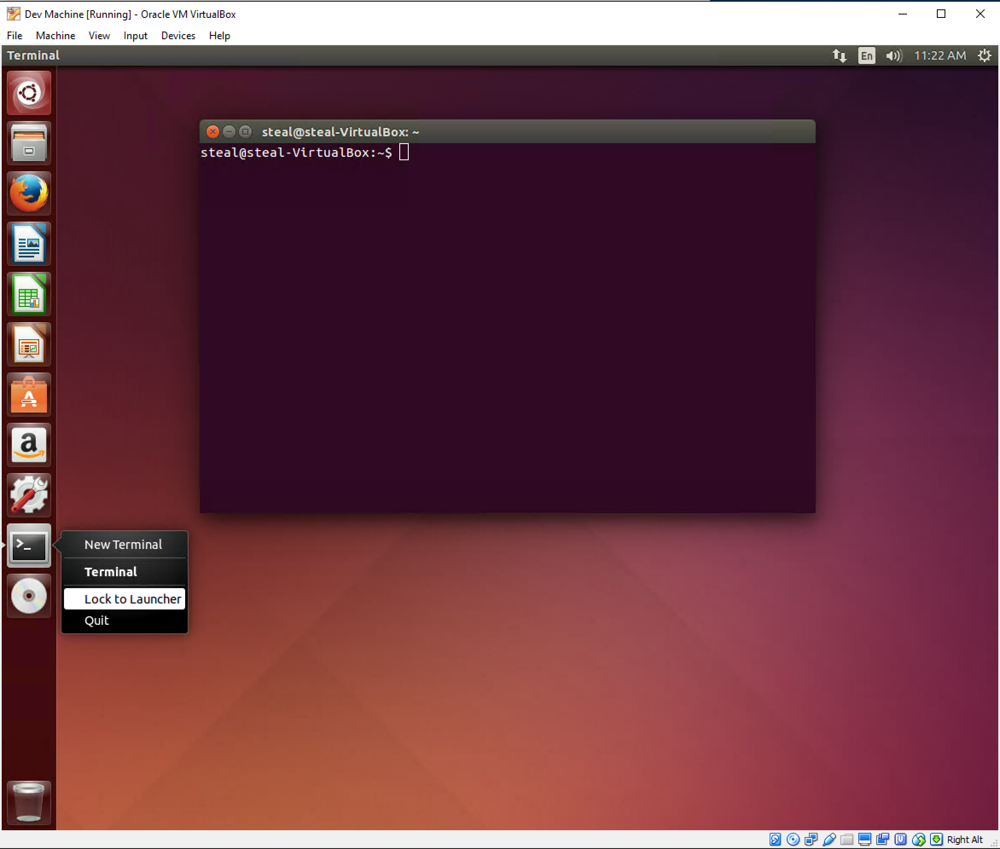

[Top](#table-of-contents)

> #### _Security tip_
Do not allow VMs to share folders and storage volumes with other VMs or with the host OS. This prevents unintended data sharing between separated domains.

[Top](#table-of-contents)


### Installing Software in the VM

Install OS updates. This step will make sure that your VM is patched with the latest security updates. Issue the following commands in a terminal.

```bash
sudo apt-get update
sudo apt-get upgrade
```

Install version control tools

```bash
sudo apt-get -y install git
```

### Installing Ubuntu Server Linux VM

Using what you know install a Ubuntu Server VM. You may download the ISO for Ubuntu Server 14.04 64bit version from here.
> Optional: Check C:/ISO/Server folder to see if this file is already on your computer

```text
http://releases.ubuntu.com/trusty/ubuntu-14.04.4-server-amd64.iso

```
You do not need to install Guest Additions for a Server VM, since it only has terminal based interactions.

### Launch an existing VM

Check C:/ISO/GenCyber folder for with `.ova` extension. If it exists, from VirtualBox select `File --> Import Appliance` menu option.

> 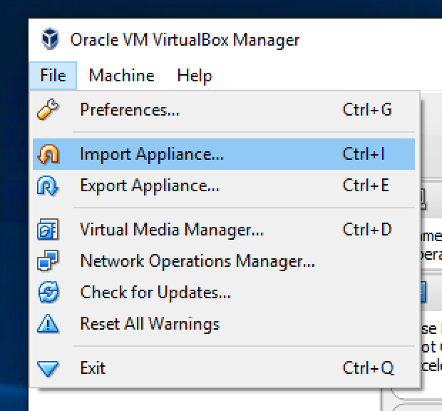

This will bring up the `Import Virtual Appliance` prompt.

> 

Navigate to the folder with the `.ova` file and click `Open`. Follow the prompts to import the VM and start it.

[Top](#table-of-contents)

### Additional Tasks

ToDo

[Top](#table-of-contents)

### Further Readings

* Virtual Box [User Manual](https://www.virtualbox.org/manual/UserManual.html)


[Top](#table-of-contents)

#### License
<a rel="license" href="http://creativecommons.org/licenses/by-nc-sa/4.0/"></a><br /><span xmlns:dct="http://purl.org/dc/terms/" property="dct:title">Cybersecurity Modules</span> by <a xmlns:cc="http://creativecommons.org/ns#" href="http://faculty.ist.unomaha.edu/rgandhi/" property="cc:attributionName" rel="cc:attributionURL">Robin Gandhi</a> is licensed under a <a rel="license" href="http://creativecommons.org/licenses/by-nc-sa/4.0/">Creative Commons Attribution-NonCommercial-ShareAlike 4.0 International License</a>.
