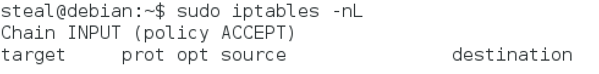

# Firewalls

Firewalls are often a first line of defense for an enterprise or home network. In this unit we will understand the fundamentals of firewalls, write firewall rules that configure its behavior and then test if the firewall performs as expected.

## Overview

The name firewall is inspired from its physical manifestation in construction which refers to walls that are designed to stop a fire from spreading.

 

While these are "cool", we are interesting in a different kind of firewall. The ones that protect internal networks from external networks. These kinds of firewalls allow us to control the flow of information across networks. 

All popular operating systems now come with a firewall installed. For server installations we will focus on the Netfilter packet filtering module built into the linux kernel itself. This module acts as a firewall and is configured using the `iptables` command. The command line use of iptables provides the utmost flexibility and control over the firewall configuration.

### Question

At what [network layer] (https://support.microsoft.com/en-us/kb/103884) does it make the most sense to operate a firewall, considering that it is connecting two different networks?

- [ ] Physical layer  
- [ ] Data link layer  
- [ ] Network layer and above  

Discussion:  
Since the headers on frames are not useful for routing across networks, typically firewalls rules are authored using information starting at the Internet layer and above all the way to the application layer. IP layer firewalls are the simplest and most widely used.

### Firewall as a Collection of Valves

Firewall can be modeled as a collection of valves  

* Each valve/port corresponds to single service  
* Each valve can  
  - Permit traffic in one or both directions  
  - Deny traffic  

  

Here are three basic scenarios to keep in mind.  

First lets consider, **Ports 1 and 4**
These ports are open. Which means they permits packets from internal and external source. So in the case of TCP protocol, which forms explicit connections or circuits before transmitting data via a handshake mechanism, such connections can be externally or internally initiated.

In the case of **Port 2**, it allows unrestricted flow of information if the connection is initiated internally. However, it blocks all external requests to initiate an information flow. That is, it permits packets from external sources only if they correspond a “connection” initiated by internal source. The firewall will not permit connection requests from external sources. This restriction is useful, when an internal web client initiates a web browsing request, then the firewall will allow the corresponding response from an external webserver to pass through the firewall. Any connection initiated externally will not be allowed.

Finally, **Port 3** is closed. Which means that it denies all traffic. A closed port may just drop the packets or send back a RST or "Reset" packet. From a security and resource consumption standpoint, it is always better to just drop the packet. Upon denial of access, no additional or useful information should be communicated back.

## Firewall Rules

Firewalls are configured using simple `if then` rules. In a packet filtering firewall, a rule says: `if source, destination and service is a match THEN take this action`. Since there are many rules involved, the order of the rules matters. A LOT!

Rules are evaluated in order, starting with the first one until a first match is discovered. So if your top rule is very generic then **none of the later specific rules will ever be evaluated**. So it best to start with rules that will most often be required to be invoked and it does not interfere with other rules. 

Always start firewall configuration with a _whitelisting_ philosophy, where you “Deny by default” and then allow only specific information flows. This means start the firewall configuration by dropping all packets. Then add rules to allow specific traffic patterns as required by our application needs.

Lets look at an example. 

  

**Rule 1** permits externally initiated requests to a webserver behind the firewall. So the source is “any” since we cannot anticipate a specific IP address at the time of writing the rule. The destination is the IP address of the webserver and the service specifies the port number where the service is typically hosted. That would be port 80 for a web server. If these three match an incoming packet then the action is “accept”

**Rule 2** permits internally initiated requests out to the Internet. So the source is any ip address in the local network, which we specify as a range of IP addresses, the destination and the service cannot be anticipated at the time of writing the rule so both are specified as “any”. If a packet matches these conditions then the action is accept. 

**Rule 3** is to deny all other traffic. So all three match conditions are specified as “any” and the action is reject. 

### Discussion: What would happen if we re-ordered these rules?

## Additional Readings

[Microsoft The OSI Model's Seven Layers Defined and Functions Explained] (https://support.microsoft.com/en-us/kb/103884)
