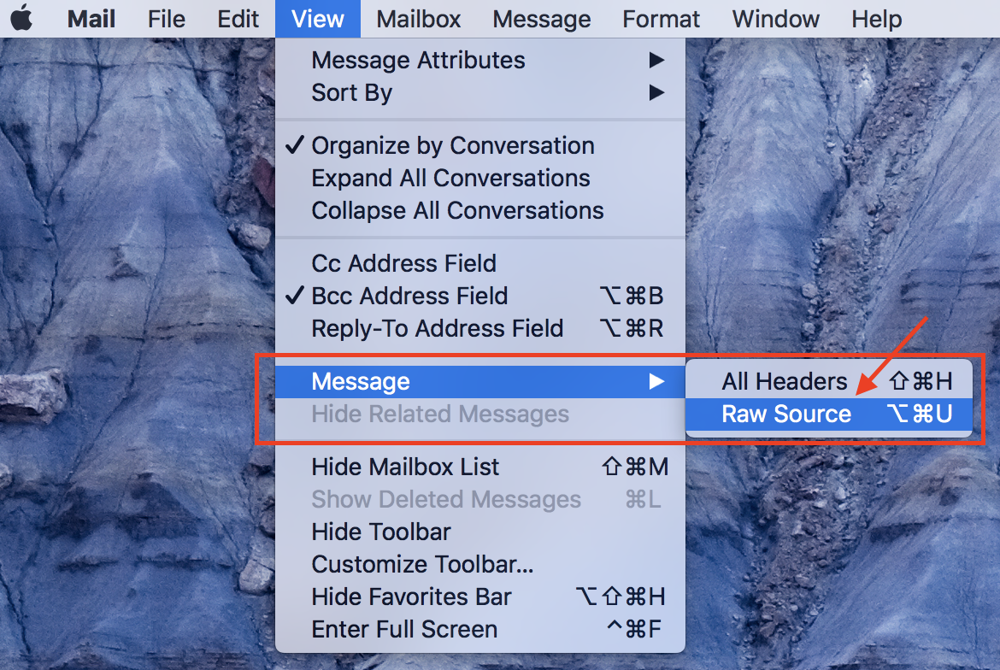
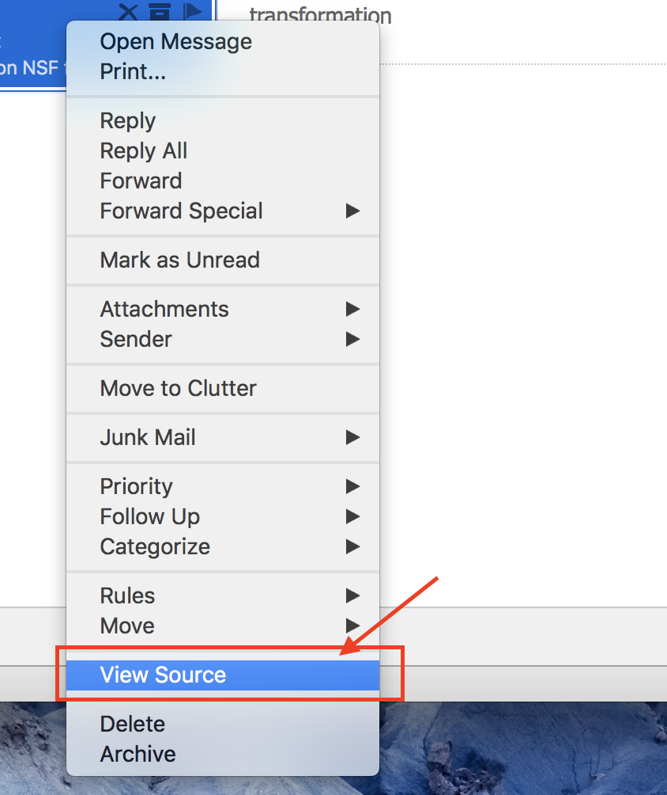
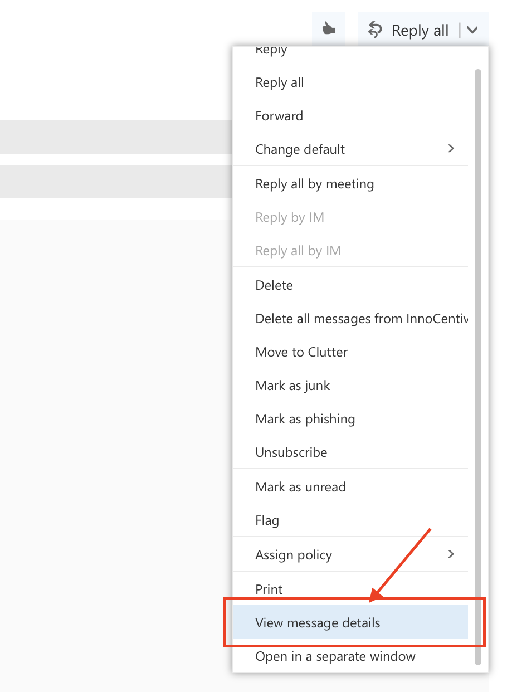
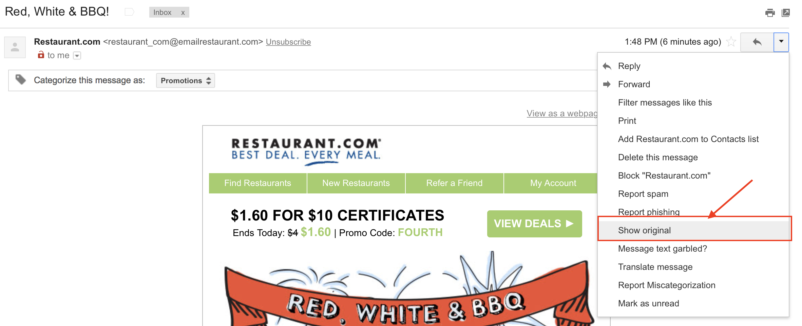
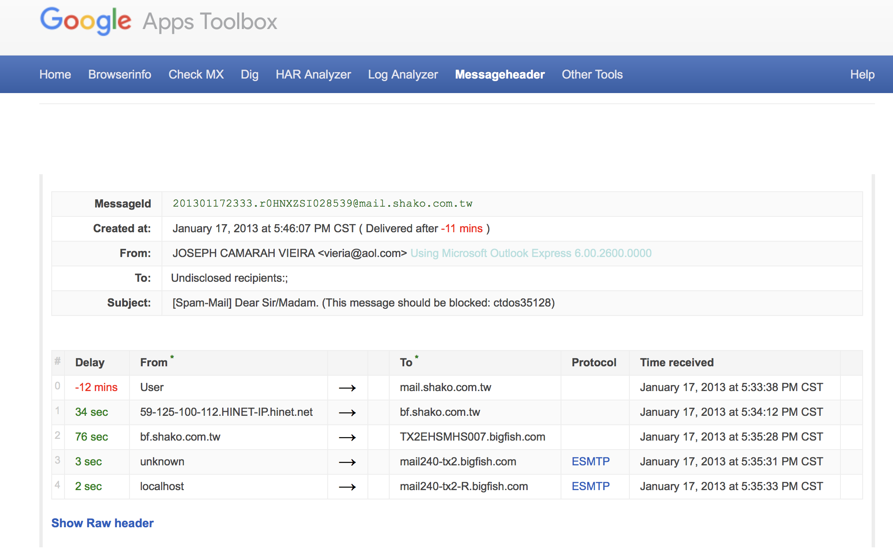

# Email Header Analysis

## Introduction (5 Mins)

Email is an indispensable communication tool. We use it everyday. Unfortunately many attacks also originate in emails. Wouldn't it be great if everyone had some mad email ninja skills! Don't worry, you will feel pretty good about your email analysis skills at the end of this session.

When reading emails, the first item that grabs our attention is the sender's name, email and subject. But, it may come as a surprise that spoofing these in a email is a pretty easy thing! It is also effective at fooling unsuspecting email users. Take a look at some of the statistics in the [Verizon Data Breach Reports](http://www.verizonenterprise.com/verizon-insights-lab/dbir/).

Here is an interesting one:

> How long does an attacker have to wait to get that foot in the door? We aggregated the results of over 150,000 e-mails sent as part of sanctioned tests by two of our security awareness partners and measured how much time had passed from when the message was sent to when the recipient opened it, and if they were influenced to click or provide data (where the real damage is done). The data showed that nearly 50% of users open e-mails and click on phishing links within the first hour. [Verizon DBIR 2014]
> 
>
>> It did not get any better in 2016: _**13%** of people tested click on a phishing attachment; median time to click is very short._

If you are a bad guy planning a heist, that is the easiest way for getting malware into an organization. So it is prudent to understand exactly where an email is “really” coming from. Do not rush to open attachments or click links in emails.

## Email Headers (10 Mins)

Email Headers hold a lot of information. Much of this information is never displayed to the user! The email reader only sees a select few pieces of information like From, Name, Subject, Date, and Sender's email.

Before we get started, consider this email from President Barack Obama to a Researcher at the University of Nebraska at Omaha. They have a a great Cyber security program. You may read about the available degree programs in Cybersecurity here: http://www.unomaha.edu/college-of-information-science-and-technology/academics/information-assurance.php


Anyways...we see emails like this all the time using desktop or web-based email clients. The section pointed to by the big red arrow, is the part of the email header that most people are familiar with.

There is more to this header. To reveal the full message header, different desktop or web email applications have different methods. Here are instructions to get the full email headers using popular email applications:

-----
#### Apple Mail


-----
#### Outlook Desktop Client


-----
#### Outlook Web Client


-----
#### Gmail


-----

It is obvious that in all cases, this information is not easy to find.

Once you do find it, there is a ton of information in the header about the path taken by an email. Let's look at some actual email headers. Open up the files in the ["email-headers" Folder](./email-headers).

Here is the raw message from [email-header1.txt](./email-headers/email-header1.txt)

```text
Received: from BL2PRD0711HT001.namprd07.prod.outlook.com (10.255.104.164) by
 BY2PRD0711HT003.namprd07.prod.outlook.com (10.255.88.166) with Microsoft SMTP
 Server (TLS) id 14.16.257.4; Thu, 17 Jan 2013 23:35:35 +0000
Received: from BL2PRD0711HT002.namprd07.prod.outlook.com (10.255.104.165) by
 BL2PRD0711HT001.namprd07.prod.outlook.com (10.255.104.164) with Microsoft
 SMTP Server (TLS) id 14.16.257.4; Thu, 17 Jan 2013 23:35:34 +0000
Received: from mail240-tx2-R.bigfish.com (65.55.88.116) by
 BL2PRD0711HT002.namprd07.prod.outlook.com (10.255.104.165) with Microsoft
 SMTP Server (TLS) id 14.16.257.4; Thu, 17 Jan 2013 23:35:34 +0000
Received: from mail240-tx2 (localhost [127.0.0.1]) by mail240-tx2-R.bigfish.com (Postfix) with ESMTP id A05C032025F for <jerryp@mail.unomaha.edu>; Thu, 17 Jan 2013 23:35:33 +0000 (UTC)
X-Forefront-Antispam-Report: CIP:59.125.100.113;KIP:(null);UIP:(null);IPV:NLI;H:bf.shako.com.tw;RD:59-125-100-113.HINET-IP.hinet.net;EFVD:NLI
X-BigFish: ps73(zz7f52hd926hzz1ee6h1de0h1ce5h1202h1e76h1d1ah1d2ahz58hz8275bhz2ei2a8h668h839h940h10d2h1177h1288h12a5h12a9h12bdh137ah139eh13b6h13eah1441h1537h162dh1631h1758h17f1h184fh1898h300k503k953iwa7jk)
X-FOSE-spam: This message appears to be spam.
X-SpamScore: 73
Received-SPF: neutral (mail240-tx2: 59.125.100.113 is neither permitted nor denied by domain of aol.com) client-ip=59.125.100.113; envelope-from=vieria@aol.com; helo=bf.shako.com.tw ;shako.com.tw ;
Received: from mail240-tx2 (localhost.localdomain [127.0.0.1]) by mail240-tx2
 (MessageSwitch) id 1358465731454940_30539; Thu, 17 Jan 2013 23:35:31 +0000
 (UTC)
Received: from TX2EHSMHS007.bigfish.com (unknown [10.9.14.242]) by mail240-tx2.bigfish.com (Postfix) with ESMTP id 675424200E7 for <jerryp@mail.unomaha.edu>; Thu, 17 Jan 2013 23:35:31 +0000 (UTC)
Received: from bf.shako.com.tw (59.125.100.113) by TX2EHSMHS007.bigfish.com
 (10.9.99.107) with Microsoft SMTP Server (TLS) id 14.1.225.23; Thu, 17 Jan
 2013 23:35:28 +0000
Received: from mail.shako.com.tw (59-125-100-112.HINET-IP.hinet.net
 [59.125.100.112]) by bf.shako.com.tw (8.14.3/8.14.3) with ESMTP id
 r0HNYCgA013928; Fri, 18 Jan 2013 07:34:12 +0800
X-Authentication-Warning: bf.shako.com.tw: Host 59-125-100-112.HINET-IP.hinet.net [59.125.100.112] claimed to be mail.shako.com.tw
Authenticated-By: nobody
X-SpamFilter-By: BOX Solutions SpamTrap 3.5 with qID r0HNXZSI028539, This message is passed by code: ctdos35128
Received: from User (85-250-54-29.bb.netvision.net.il[85.250.54.29])
(authenticated bits=0)
by mail.shako.com.tw (8.14.3/8.14.3/4.90) with ESMTP
 id r0HNXZSI028539; Fri, 18 Jan 2013 07:33:38 +0800
X-BOX-Message-Id: r0HNXZSI028539
Message-ID: <201301172333.r0HNXZSI028539@mail.shako.com.tw>
X-Authentication-Warning: mail.shako.com.tw: Host 85-250-54-29.bb.netvision.net.il[85.250.54.29] claimed to be User
Reply-To: <carrr444@yahoo.com>
From: JOSEPH CAMARAH VIEIRA <vieria@aol.com>
Subject: [Spam-Mail] Dear Sir/Madam. (This message should be blocked: ctdos35128)
Date: Fri, 18 Jan 2013 01:46:07 +0200
Content-Type: text/plain; charset="Windows-1251"
Content-Transfer-Encoding: 7bit
X-Mailer: Microsoft Outlook Express 6.00.2600.0000
X-MimeOLE: Produced By Microsoft MimeOLE V6.00.2600.0000
To: Undisclosed recipients:;
Return-Path: 32309uslisidfj@mail.shako.com.tw.com
X-MS-Exchange-Organization-SCL: 7
X-MS-Exchange-Organization-AVStamp-Mailbox: MSFTFF;1;0;0 0 0
X-MS-Exchange-Organization-AuthSource: BL2PRD0711HT002.namprd07.prod.outlook.com
X-MS-Exchange-Organization-AuthAs: Anonymous
MIME-Version: 1.0
Dear Sir/Madam,
my name is Joseph Camarah Vieira, i  am from Guinea Bissau, my late father was the former minister of mines in my country Guinea Bissau, he was short dead by the rebels in my country, before his death he deposited $60 million Dollars with Global Trust Security Company Accra Ghana, i want you to help me receive this money in your country for investment in your country i will give you 30% of the total sum when the funds arrive your country.

Regards.
Mr Joseph Camarah Vieira
00233 244 617 863
my email:carrr444@yahoo.com

```

#### Discussion:
What are your first thoughts?

## Headers are like Passports

Consider a Turkey citizen, who is traveling from the U.S. to China via stops in Germany and India. Authorities in countries in each leg of her trip would record the source and destination of the previous leg in the passport.  Assume that she has appropriate visas for all the visited countries. One way to describe the journey in her passport could be as follows, with the most recent entry at the top:

```text
Passenger-Received: from India by China     # Chinese Authority
Passenger-Received: from Germany by India   # Indian Authority
Passenger-Received: from U.S. by Germany    # German Authority
```

The header is like a passport for your email. The header receives an entry at every stop along the way by the email server it encounters. As a result, the more servers the email is routed through, the longer the header.

Now, if you observe [email-header1.txt](./email-headers/email-header1.txt) there seems to be a lot of **`Received:`** entries in there. Where in this file do we start to trace the email source and its various hops to the final destination?

Here is some information to help us do this. As an email travels from the source to its destination, each server adds its header entries to the top of the header, which is at the top of the email body to begin with. So if we want to trace the email origin, this will be the very first **`Received:`** entry encountered from the **bottom of the header**. If you see something like `Received-SPF:`, ignore it.

For [email-header1.txt](./email-headers/email-header1.txt) start scanning from the bottom of the header towards the top and examine the very first **`Received:`** entry. It looks like this:

```text
Received: from User (85-250-54-29.bb.netvision.net.il[85.250.54.29])
(authenticated bits=0)
by mail.shako.com.tw (8.14.3/8.14.3/4.90) with ESMTP
 id r0HNXZSI028539; Fri, 18 Jan 2013 07:33:38 +0800
```
The first email-server to receive the email from the sender's computer creates this entry. If the email client is web-based then this entry will include details about the server hosting the email web application.

Let's further breakdown this entry. The `from` part of this entry indicates source of the email for this leg of the travel: `User (85-250-54-29.bb.netvision.net.il[85.250.54.29])`. You can pick out a Domain Name (`85-250-54-29.bb.netvision.net.il`) and an IP address (`85.250.54.29`) here.

The `by` part indicates the destination:  
`mail.shako.com.tw (8.14.3/8.14.3/4.90)`. You can pick out a Domain Name here: `mail.shako.com.tw`.

The first encountered email server adds this header entry and every other entry below it. There is a high chance that a malicious sender has full control of this email-server. So do not trust this information.  
Regardless, we now have some information to do further investigation. Let's try to figure out where the geographic location of the email-server.

We can use a online utility like http://network-tools.com and enter the domain name or IP address as a query. Here we use `85-250-54-29.bb.netvision.net.il` and `mail.shako.com.tw` as queries.

```text

SEARCH RESULTS: 85-250-54-29.bb.netvision.net.il

85.250.54.29 is from Israel (IL) in region Middle East
Input: 85-250-54-29.bb.netvision.net.il
canonical name: 85-250-54-29.bb.netvision.net.il
Registered Domain: netvision.net.il

SEARCH RESULTS: mail.shako.com.tw

202.39.131.130 is from Taiwan (TW) in region Southern and Eastern Asia
Input: mail.shako.com.tw
canonical name: mail.shako.com.tw
Registered Domain: shako.com.tw

```

The searches reveal that a computer in `Israel` used a email server in `Taiwan` as the first stop on its way to the U.S., while the actual body of the email claims the sender is from `Guinea Bissau.` Something is not right!

There are few other fields that you should investigate in the email header.  

* `Return-Path:` See if the email address in this entry matches the email address in the `From:` entry. They typically will not match for mass emailers like advertisers or spammers. The `Return-Path:` email address is used when a email cannot be delivered to its recipients, and it "bounces back". Spammers don't want all the undelivered email to end up in their inboxes!

* `Reply-To:` See if the email address in this entry matches the email address in the `From:` entry. When you hit reply to an email, the `Reply-To` entry is used to populate the recipients' email. If it is different, you may accidentally send your reply to someone else.

* `X-Distribution:` if this field's value is *bulk*. This indicates bulk/spam email.

* `X-Mailer:` field indicates the email client. If it includes weird names, be suspicious.

* `Bcc:` or `X-UIDL:` entries exist. This is a sign of poorly crafted header. They are never in normal emails.

* `X-Spam score`, `X-Spam flag` and `X-Spam status` entries help determine “spaminess”. But the scores are not standardized across servers so these have to examined on a case by case basis.

Google has a [online tool](https://toolbox.googleapps.com/apps/messageheader/) that helps to examine the "hops" and the time delay between them. Large delays in accepting email by the first server may be a sign of overloaded and resource constrained spam servers. Here's what the tool shows about [email-header1.txt](./email-headers/email-header1.txt). There is a suspicious 12 minute delay right at the beginning, which may indicate a overloaded spam sending email server. Sometimes, time difference between servers may cause false positives.



## Exercise (15 Mins)

Open up the files in the ["email-headers" Folder](./email-headers) and then answer the questions in each one of them. Check your answers with a peer. If they differ then work with your peer to come to a final conclusion. Use the following online tools as shown above.

* [network-tools](http://network-tools.com)
* [Google Message Header Analyzer](https://toolbox.googleapps.com/apps/messageheader/)


## What about that email from President Barack Obama? (5 Mins)

Here is the raw header:

```text
Received: from BY2PR07MB042.namprd07.prod.outlook.com (10.255.240.146) by
 SN2PR07MB048.namprd07.prod.outlook.com (10.255.174.148) with Microsoft SMTP
 Server (TLS) id 15.0.837.10 via Mailbox Transport; Tue, 10 Dec 2013 03:53:20
 +0000
Received: from CO2PR07CA008.namprd07.prod.outlook.com (10.141.194.176) by
 BY2PR07MB042.namprd07.prod.outlook.com (10.255.240.146) with Microsoft SMTP
 Server (TLS) id 15.0.837.10; Tue, 10 Dec 2013 03:53:17 +0000
Received: from BN1BFFO11FD039.protection.gbl (2a01:111:f400:7c10::1:118) by
 CO2PR07CA008.outlook.office365.com (2a01:111:e400:1414::48) with Microsoft
 SMTP Server (TLS) id 15.0.800.7 via Frontend Transport; Tue, 10 Dec 2013
 03:53:17 +0000
Received: from loki.ist.unomaha.edu (137.48.187.123) by
 BN1BFFO11FD039.mail.protection.outlook.com (10.58.144.102) with Microsoft
 SMTP Server id 15.0.825.6 via Frontend Transport; Tue, 10 Dec 2013 03:53:16
 +0000
Received: from loki.ist.unomaha.edu (localhost [127.0.0.1])	by
 loki.ist.unomaha.edu (Postfix) with ESMTP id DC7C51E0577	for
 <smartprof@unomaha.edu>; Mon,  9 Dec 2013 21:53:15 -0600 (CST)
Subject: RE: Research
Date: Mon, 9 Dec 2013 21:53:15 -0600
Content-Type: text/html; charset="utf-8"
To: <smartprof@unomaha.edu>
Content-Transfer-Encoding: quoted-printable
From: <barack.obama@whitehouse.gov>
Message-ID: <20131210035315.DC7C51E0577@loki.ist.unomaha.edu>
Return-Path: barack.obama@whitehouse.gov
X-MS-Exchange-Organization-MessageDirectionality: Incoming
X-Forefront-Antispam-Report: CIP:137.48.187.123;CTRY:US;IPV:NLI;EFV:NLI;SFV:NSPM;SFS:(199002)(189002)(44976005)(49866001)(74366001)(558084003)(70486001)(221733001)(80976001)(76786001)(76796001)(87836001)(19580395003)(81542001)(83322001)(90146001)(87266001)(47736001)(79102001)(15975445006)(4396001)(69226001)(46102001)(50466002)(80022001)(76482001)(65816001)(74876001)(74706001)(54356001)(56776001)(53806001)(23846002)(47976001)(50986001)(81686001)(59766001)(51856001)(54316002)(23676002)(76176001)(2171001)(31966008)(85306002)(81816001)(56816005)(81342001)(77982001)(20776003)(47446002)(74662001)(74502001)(83072002)(90896003)(85852003)(63696002)(33656001)(14943795004);DIR:INB;SFP:;SCL:1;SRVR:BY2PR07MB042;H:loki.ist.unomaha.edu;CLIP:137.48.187.123;FPR:;RD:loki.ist.unomaha.edu;A:1;MX:1;LANG:en;
X-MS-Exchange-Organization-Network-Message-Id: d79a623f-5a28-4790-fab8-08d0c3727ebc
X-MS-Exchange-Organization-AVStamp-Service: 1.0
Received-SPF: SoftFail (: domain of transitioning whitehouse.gov discourages
 use of 137.48.187.123 as permitted sender)
X-MS-Exchange-Organization-SCL: 1
X-MS-Exchange-Organization-AuthSource: BN1BFFO11FD039.protection.gbl
X-MS-Exchange-Organization-AuthAs: Anonymous
MIME-Version: 1.0

<meta http-equiv=3D"Content-Type" content=3D"text/html; charset=3Dutf-8">Dr=
. Gandhi,<br>
Congratulations on your most recent achievements in your
research.<br>
Please refer to the below URL to review your funding
request.<br>
<a href=3D"https://nullifyctf.com">Grant funding request.</a><br>
Yours truly,<br>
Barack Obama<br>
President, United States of America
```

Questions:

* What are the `From` and `Return-Path` email addresses. Do they match? What are they?
* What is the name of the sending computer or server?
* Where is the sending computer geo-located?
* What website is linked to “Grant funding request.” in the message?
* How likely is it that this message is spam?

## Additional Tasks:

Pick an spam email in your inbox. Inspect discrepancies in its headers and investigate the source of the email. Spot traps that can misguide a email user. Share this knowledge with your friends and family.

[Phishing](https://www.consumer.ftc.gov/articles/0003-phishing) emails often appear to be from someone you know. They  ask for urgent and critical actions like sending money, sharing bank information and passwords. Double-check the real source of the email. Follow-up with a call to confirm the emergency.

Stay Vigilant!

## Additional Readings and Tools:

* How to locate raw headers in email clients. [mxtoolbox](https://mxtoolbox.com/Public/Content/EmailHeaders/)

* Advanced email headers. [ARCLAB](https://www.arclab.com/en/kb/email/how-to-read-and-analyze-the-email-header-fields-spf-dkim.html)


License:
<a rel="license" href="http://creativecommons.org/licenses/by-nc-sa/4.0/"></a><br /><span xmlns:dct="http://purl.org/dc/terms/" property="dct:title">Cybersecurity Modules</span> by <a xmlns:cc="http://creativecommons.org/ns#" href="http://faculty.ist.unomaha.edu/rgandhi/" property="cc:attributionName" rel="cc:attributionURL">Robin Gandhi</a> is licensed under a <a rel="license" href="http://creativecommons.org/licenses/by-nc-sa/4.0/">Creative Commons Attribution-NonCommercial-ShareAlike 4.0 International License</a>.
