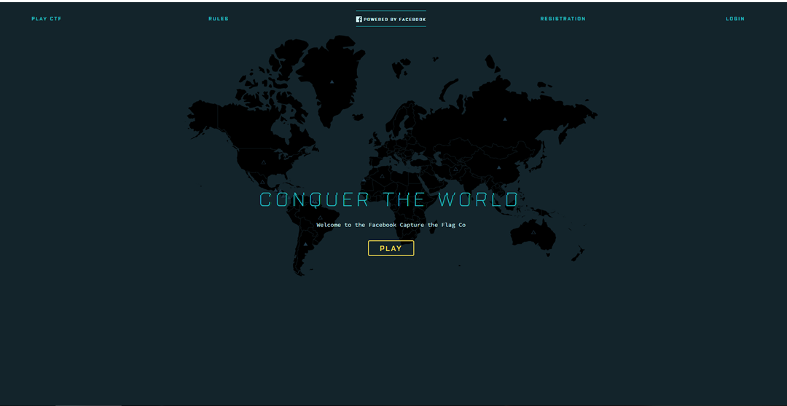
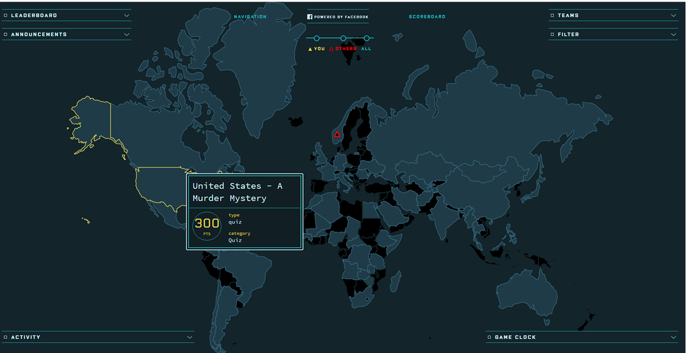

## Facebook CTF Installation

Facebook CTF is a new open source platform. The project is available at [https://github.com/facebook/fbctf](https://github.com/facebook/fbctf).

### Installation and Deployment

The platform is very easy to install and has an accessible interface

#### Prereqs for installation

First, create a new virtual machine using Virtual Box. You may follow the [Day 1 virtualization tutorial](../day1/virtualization-primer.md) to setup your virtual machine. Make sure to use [Ubuntu 14.04 (Trusty Thar)](http://releases.ubuntu.com/14.04/) as your guest operating system. FBctf suggests the [64bit server iso](http://releases.ubuntu.com/14.04/ubuntu-14.04.4-server-amd64.iso) for production deployments of FBctf.

#### Installation 
Once you have a default install of 14.04 configured and installed, the actual FBCTF platform can be easily deployed using 5 simple commands.

```bash
sudo apt-get update
sudo apt-get install git
git clone https://github.com/facebook/fbctf
cd fbctf
./extra/provision.sh -m prod -s $PWD
```

During the installation process you should be prompted to enter the password you established for your ubuntu VM 3 different times. When you are done, make sure to note the password listed on the terminal. Write this down somewhere.

In general this will look something like:

```bash
[+] Creating user...
[+] DB Connection file
[+] Adding default admin user
[+] The password for admin is: 0eb1a4e0380ac5c34aa6bcdf058b101d
[+] fbctf deployment is complete! Ready in https://10.10.10.5
```

Optionally, you can change this default password using the following commands.

```bash
. ./extra/lib.sh
set_password <new password> ctf ctf fbctf $PWD
```

where <new password> should be replace by the password you would like to set.

### Logging in

Once running, you may navigate to the listed IP address and you should see something like:


Login using the password you set or the default password.

Clicking 'gameboard' from the admin menu will take you to a country board that looks like:


### Aditional Info
For more information, refer to the [FBCtf documentation](https://github.com/facebook/fbctf)

#### License:
<a rel="license" href="http://creativecommons.org/licenses/by-nc-sa/4.0/"></a><br /><span xmlns:dct="http://purl.org/dc/terms/" property="dct:title">Cybersecurity Modules</span> by <a xmlns:cc="http://creativecommons.org/ns#" href="http://faculty.ist.unomaha.edu/rgandhi/" property="cc:attributionName" rel="cc:attributionURL"> Matt Hale, Robin Gandhi, Cade Wolcott, and Aaron Vigal</a> is licensed under a <a rel="license" href="http://creativecommons.org/licenses/by-nc-sa/4.0/">Creative Commons Attribution-NonCommercial-ShareAlike 4.0 International License</a>.